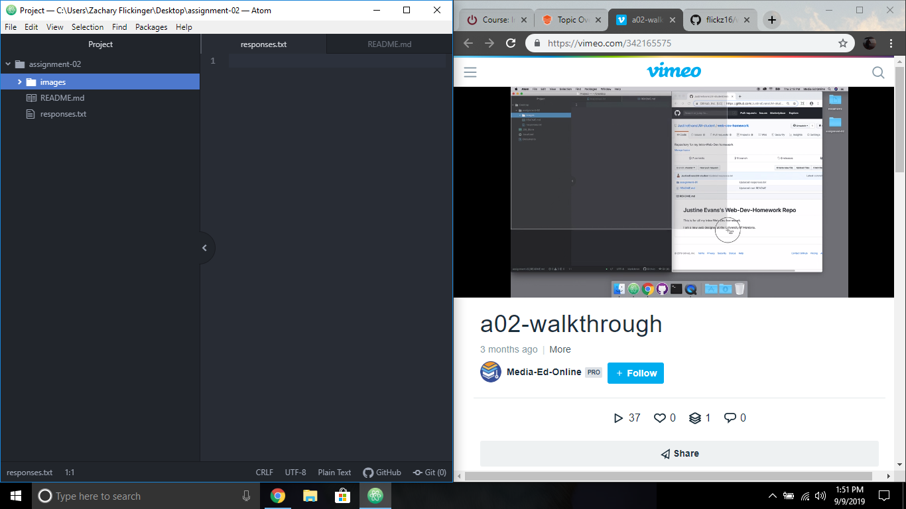

# Assignment-02
## Zachary Flickinger

I decided to take this course because coding has always intrigued me and it seems very applicable for after I graduate. As Journalism being my degree, understanding website coding should help me look more hire able after I graduate.

- How to make a heading
- How many bits are in a IP address
- Fiberoptic is way more advanced for traveling bits at the speed of light

[ESPN Homepage](https://www.espn.com/)

[My Responses File](./responses.txt)

