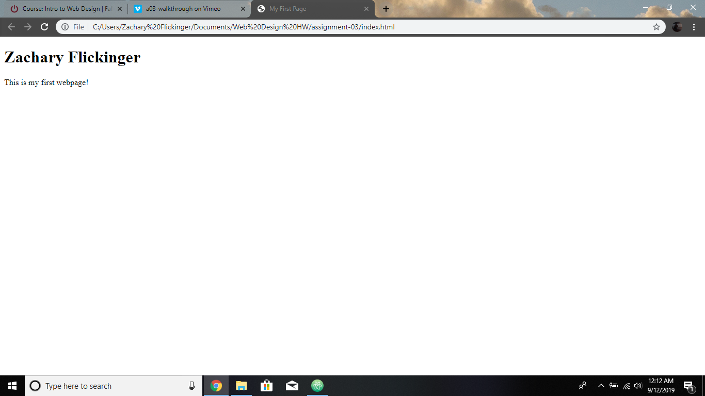

Web browsers work by use of a user interface, a rendering engine and browser engine, a JavaScript interpreter, data storage and communicating over the network. I currently use Google Chrome to surf the internet

A markup language is what dictates the architecture of a page with its text content and is the combination of markup, style and scripts. A common markup language is HTML.

