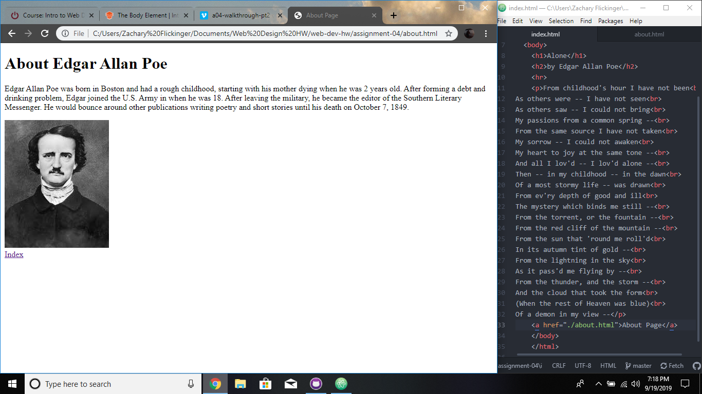

# Assignment 04
## Zachary Flickinger
I went back and looked at ESPN's webpage from 1998 and it has changed a ton! It had very standard use of HTML, with a lot of headers and line breaks. It has changed by how the current site uses CSS to style it while the older version had almost no CSS.

 GIT Module is a pretty simple way to add changes without having to drag and drop things to the website. I understood it and was super easy to manage.

