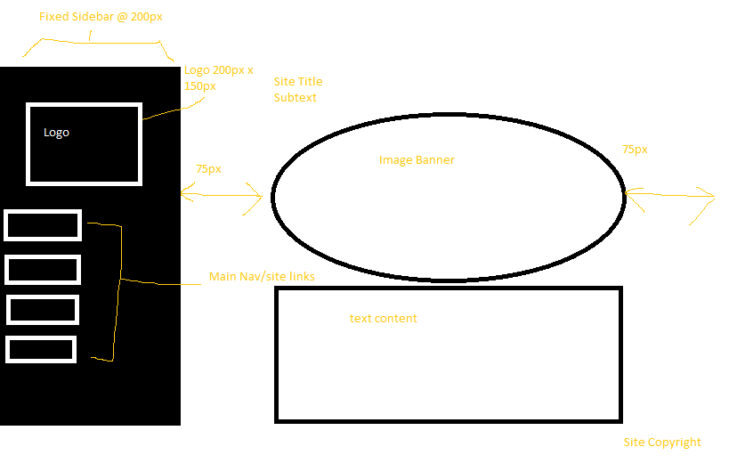

Padding is the space between the inner content of a element and the element itself. Borders are the content right outside the element. Margins are the space between the box/element or the edge of the parent element.

This one took awhile for me to grasp, and I still have quite a ways to go. I started by drawing a rough sketch of what I wanted the website design to be. Then, I went through the website directions learning all about margin, display, position, float, etc. Then I tried my best to correlate that onto my website design through a ton of trial and errors. I wasn't able to stick exactly to my design but I tried my best.
